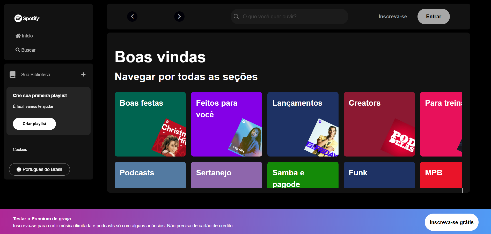

# Página de Navegação Inspirada no Spotify
Esse projeto foi criado durante a Imersão Front-end da [Alura](https://www.alura.com.br/), do dia 27 à 31 de janeiro. Durante a imersão, pude aprender novos conceitos de front-end e também revisar os que eu já sabia, tendo como principal experiência ver como profissionais trabalham o código para mantê-lo organizado e limpo.

## Tecnologias Utilizadas
- **HTML:** é a linguagem padrão para criação de páginas web. Ele define a estrutura e o conteúdo da página.
- **CSS:** é a linguagem usada para estilizar páginas web.
- **JavaScript:** linguagem de programação essencial para tornar as páginas web dinâmicas e interativas.
- **jQuery:** Uma biblioteca JavaScript que simplifica a manipulação do DOM, eventos e animações. Com jQuery, é possível escrever menos código para realizar tarefas comuns.

## Exemplo de execução

## Probemas a Serem Resolvidos
Um dos objetivos era que quando o usuário digitasse o nome de um dos cantores da api na barra de pesquisa, esse cantor fosse exibido na tela, mas ao invés de retornar somente o cantor solicitado, está sendo retornado todos os cantores presentes na api, fazendo que somente o último cantor seja exibido.

### Agradecimentos
Deixo aqui meus sinceros agradecimentos para toda a equipe da Alura, em especial ao professor [Guilherme](https://github.com/guilhermeonrails), por disponibilizar um conteúdo incrível desse gratuitamente. 
Muito obrigado!